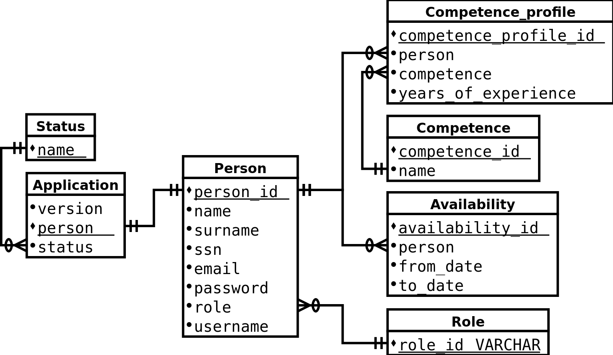

# Recruitment Application - Project in IV1201, Arkitektur och design av globala applikationer at KTH EECS

[](https://travis-ci.org/MarcusNilssonGithub/iv1201-project)

A simple recruitment website built with Node.js for an unspecified amusement park as part of the course IV1201 at KTH.

The in-production website is hosted on Heroku and is live on https://iv1201-project.herokuapp.com

## Requirements

- Backend code is written in [Node.js](https://nodejs.org/), which is required to run the website. (Mandatory)
- Frontend code is written JavaScript using the React framework.[React](https://reactjs.org/)(Mandatory)
- [Docker and Docker-compose](https://www.docker.com/) are used to host a development environment locally. (Mandatory)
- The database migration program is written in [Go](https://golang.org/). (Optional)

## Install dependencies

From project root:

```bash
npm install --prefix frontend backend   # install dependencies in frontend and backend
```

## Run development environment

The development environment uses Docker-compose to provide a fully functional site which is reachable on http://localhost/.

From project root:

```bash
docker-compose up --build    # start development server
```

## Run tests against the development environment

Must be run in a separate terminal when the Docker environment is fully up and running.

```bash
docker exec -it app npm run test-docker --prefix backend    # Run tests in development env
```

## Project structure

```
Project root
│
├── backend  
│   ├── logs  
│   ├── src  
│   │   ├── bin  
│   │   │   └── routes  
│   │   ├── controller  
│   │   ├── integration  
│   │   ├── model  
│   │   └── util  
│   │       ├── error  
│   │       ├── logger  
│   │       └── middlewares  
│   │           ├── auth  
│   │           ├── error  
│   │           └── validate  
│   └── __tests__  
├── database  
├── frontend  
│   ├── public  
│   └── src  
│       ├── component  
│       │   └── innerComponent  
│       └── resources  
│           └── styles  
└── node_modules
```

### Current API
We have the following endpoints:  
/api/user(POST)  
/api/comptenec(GET)  
/api/application (POST, GET, PUT)  
/api/logi (POST)  
### Backend  
The backend conforms to the MVC pattern, but without a classic view since there is no backend rendering, the application is a CRUD app, following REST conventions.  
- The flow of the application: A route is added in the route directory taking in a http request, then it calls a controller in the controller directory, the controller uses the models in the model directory and the models has contacts to the DAO:s in the integration layer that connect databasen.  
Route -> Controller -> Model -> Integration
- When creating a new route follow the flow mentioned aboe and the following naming conventions  
  
Example: in the route directory there is a file named application with the application route, in the controller directory the application controller is in a file named application, in the model directory the application file contains the application model, all files in route, controller and model share the same name. In the integration directory the file is called applicationDAO and it contains application DAO.
### Frontend  
- React components are divided in components and inner components. In the components map larger components are stored for example, pages and the navbar. The inner components are smaller, have less functionality and are used in other components.
- New routes need to be added in the app component.
- New Pages are placed in the components directory

## Run database migration

The database migration solution relies on being provided with environment variables in order to connect to the old database. Placeholders are available in the file `database/example_migration_env` but for clear reasons need to be changed in order to work live.  
Output is written to the files `database/database_dump.sql`, `database/admins_to_email.txt`, and `database/users_to_email.txt`, which are overwritten every time the program is run.  
It is up to the end user to ensure that this does not become an issue.

```bash
source database/example_migration_env    # Set connection credentials as environment variables
go run database/dbmigration.go           # Run migration program
```

Depending on what columns are missing from a specific person in the database the person and its associated data in other tables will be either:  
- added to `database_dump.sql` (no missing columns) along with any other associated data
- added to `[admins|users]_to_email` (missing anything but email if normal user, or having at least a username if admin)
- discarded completely (missing primary key, or not having an email if user)

```bash
less database_dump.sql    # View file content in terminal
less admins_to_email.txt
less users_to_email.tx
```

`database_dump.sql` can then be loaded into a Heroku-hosted Postgres database by running the following when logged into Heroku in a terminal.
This can then be loaded into a Heroku-hosted Postgres database by running the following when logged into Heroku in a terminal.

```bash
heroku pg:psql --app name-of-your-application-on-heroku < database/database_dump.sql
```

## Database model


